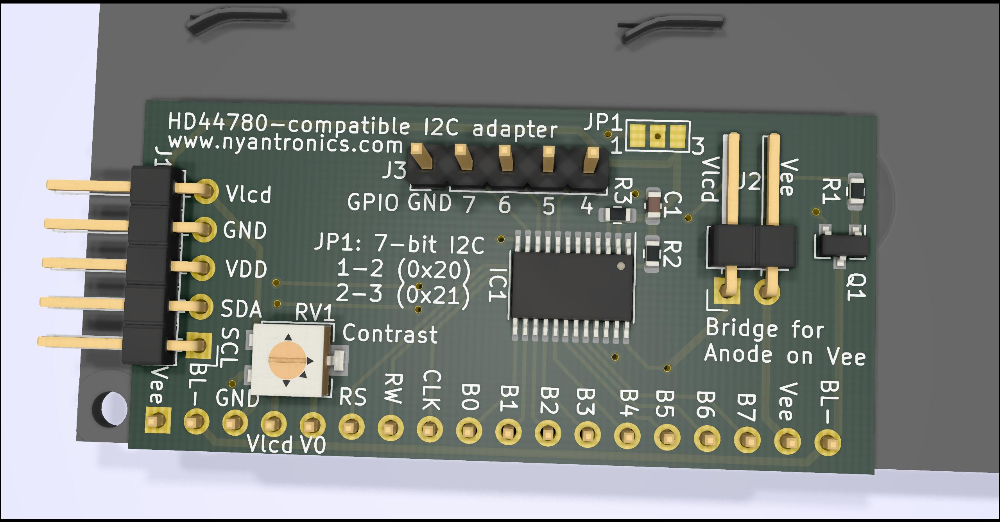

# HD44780-compatible I2C adapter #

This project is a basic I2C expander module that allows for interfacing with a variety of 14 to 16-pin, HD44780-compatible displays:

- 14-pin without backlight.
- 16-pin with A/K backlight pins after pin 14.
- 16-pin with A/K backlight pins before pin 1.
- 16-pin with Vee negative bias voltage output on pin 16 instead of backlight ground.

This adapter is compatible with both 3.3V and 5V I2C bus levels. The 5-pin MCU/MPU side header has the following connections:

1. **Vlcd:** LCD-side voltage. This is 5V for a 5V display.
2. **GND:** Ground connection.
3. **Vi2c:** I2C bus voltage. This is 3.3V for a 3.3V MCU.
4. **SDA:** I2C data line.
5. **SCL:** I2C clock line.

## TODO ##

This is currently a draft design. It likely will not work (reliably) yet.